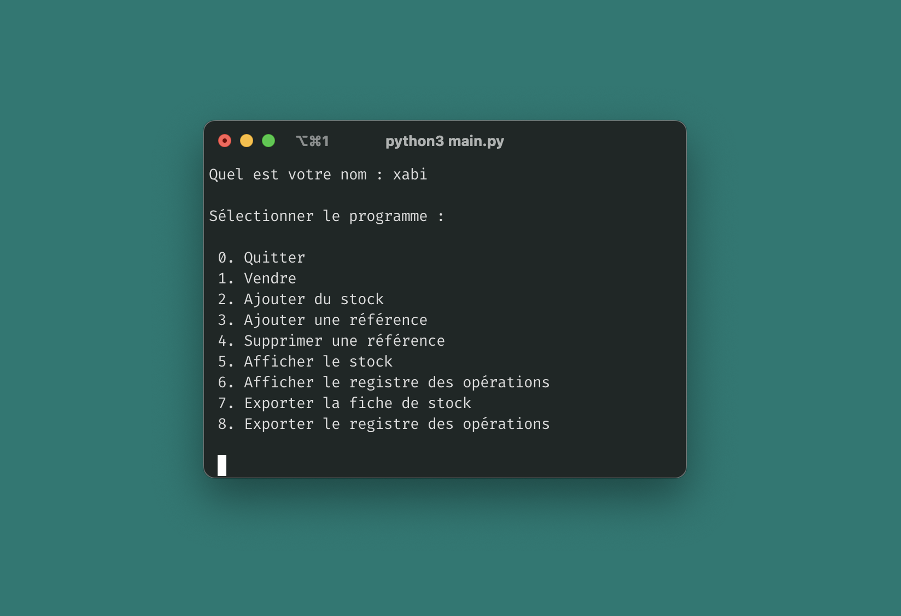

# Inventaire Python

Premier projet de programmation dans le cadre de mon apprentissage du langage Python.

## Fonctionnalités

Ce petit programme permet de gérer un inventaire de produits. Il est possible de :
1. vendre une référence ; 
2. ajouter du stock pour une référence. 
3. ajouter une référence produit dans l'inventaire ; 
4. supprimer une référence produit de l'inventaire ; 
5. consulter le stock disponible de chaque produit ; 
6. exporter la fiche de stock.

## Structure

Les programmes sont accessibles depuis le menu principal (contenu dans le fichier [main.py](main.py)).
Chaque programme est stocké dans [`/programs`](programs) et fait appel à des fonctions
stockées dans le fichier [fonctions.py](library/fonctions.py) situé dans le répertoire [`/library`](library). 
Les données de l'inventaire sont contenues dans [inventaire.py](data/inventaire.py) 
situé dans le répertoire [`/data`](data).

## Logique

Consulter le diagramme : [Algorithme.drawio](documentation/schéma_algorithme.drawio).

